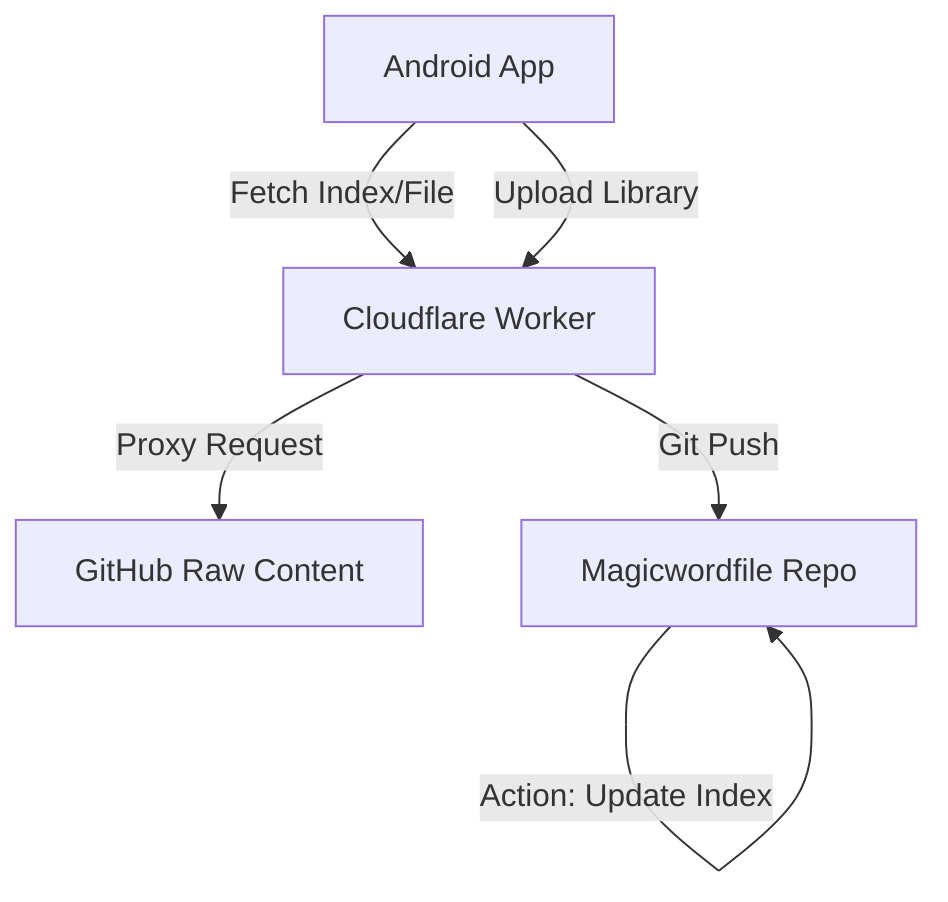

# MagicWord (EasyWord)

> 🚀 **全栈式 AI 背词解决方案**
>
> 这是一个包含 Android 客户端、Cloudflare 服务端和 Git 数据仓库的完整生态系统。不仅是一个 App，更是一个去中心化的词库共享平台。


---

## 📚 目录

1. [项目架构 (Architecture)](#-项目架构-architecture)
2. [Android 客户端详解](#-android-客户端详解)
3. [服务端 (Cloudflare Worker)](#-服务端-cloudflare-worker)
4. [数据仓库与协议 (Data Warehouse)](#-数据仓库与协议-data-warehouse)
5. [在线词库 API 规范](#-在线词库-api-规范-protocol)
6. [开发与部署](#-开发与部署)

---

## 🏗 项目架构 (Architecture)

本项目由三个核心部分组成，协同工作以提供完整的在线词库体验：

1.  **Android Client (`easyword`)**: 
    - 用户界面与核心逻辑。负责单词记忆、测试、本地管理以及与服务端的交互。
2.  **Server Proxy (`cf`)**: 
    - 部署在 Cloudflare Workers 上。作为中转站，代理客户端对 GitHub Raw 数据的请求（解决 CORS 和网络问题），并处理词库上传请求（写入 GitHub 仓库）。同时提供一个轻量级的管理后台。
3.  **Data Warehouse (`magicwordfile`)**: 
    - 一个独立的 GitHub 仓库。存储所有用户上传的词库文件。利用 GitHub Actions 自动生成分页索引 (`index_X.json`) 和元数据 (`num.json`)。



---

## 📱 Android 客户端详解

基于 **Jetpack Compose** + **MVVM** + **Kotlin Coroutines** 构建的现代化 Android 应用。

### 核心模块

#### 1. 词库管理 (Library Manager) - **[核心升级]**
*   **本地词库**: 支持创建、删除、重命名本地词库。
*   **在线词库 (Online Library)**:
    *   **分页加载**: 客户端读取 `num.json` 获取总页数，按需加载 `index_X.json`。
    *   **智能搜索**: 支持按“关键词”和“标签 (Tag)”组合搜索。客户端自动遍历最近的索引页进行过滤。
    *   **标签系统**: 左侧侧边栏展示云端热门标签 (`tags.json`)，点击即可筛选。
    *   **上传分享**: 支持将本地词库打包上传，上传时可添加多个标签（如 `雅思`, `听力`）。
*   **导入导出**: 支持 JSON 格式的批量导入导出。

#### 2. 沉浸式学习 (Study & Words)
*   **SM-2 算法**: 内置 SuperMemo-2 记忆算法，根据用户对单词的熟悉程度（0-5评分）自动安排下一次复习时间。
*   **AI 辅助**: 集成大模型 API (Qwen/SiliconFlow)，提供单词的深度解析、助记法和例句。
*   **TTS 发音**: 调用系统 TTS 引擎朗读单词和例句。

#### 3. 测试系统 (Test)
*   **多模式**: 支持“选择题”和“拼写题”。
*   **错题本**: 自动记录错题，影响 SM-2 权重。

#### 4. 系统设置 (Settings)
*   **自动更新**: 启动时检查 GitHub Release (或 `notice.json`)，支持应用内自动下载并安装 APK。
*   **公告通知**: 接收服务端发布的动态通知 (`notice.json`)，支持弹窗展示和“不再提示”。

### 关键技术实现
*   **网络层**: Retrofit + OkHttp。对 `Response.body` 的访问进行了严格封装，兼容不同版本的 OkHttp。
*   **数据层**: Room Database。`WordDao` 提供全量的增删改查和全文检索 (`FTS4`)。
*   **并发处理**: 使用 `Kotlin Flow` 和 `Coroutines` 处理高并发网络请求（如批量导入时的 AI 提取）。

---

## ☁️ 服务端 (Cloudflare Worker)

位于 `cf/` 目录，部署为 `magicword-proxy`。

### 功能职责
1.  **CORS 代理**: 允许 Web 和 App 跨域访问 GitHub Raw 数据。
2.  **上传网关**: 接收客户端上传的 JSON 数据，将其解码并 commit 到 `magicwordfile` 仓库。
3.  **管理后台**: 提供 `/upxuu` 路径的 Web 界面，用于管理员审核、删除违规词库、发布系统通知。

### 部署配置
*   **环境**: Cloudflare Workers
*   **KV 存储**: 用于存储管理员 Session 或临时配置。
*   **环境变量**: 需配置 `GITHUB_TOKEN`, `REPO_OWNER`, `REPO_NAME` 等。

---

## 📦 数据仓库与协议 (Data Warehouse)

位于 `magicwordfile` 仓库。这是系统的“数据库”。

### 目录结构
```text
magicwordfile/
├── .github/workflows/update_index.yml  # 核心自动化脚本
├── index_0.json                        # 分页索引 (第0页，最新)
├── index_1.json                        # 分页索引 (第1页)
├── num.json                            # 元数据 (总页数、总条数)
├── tags.json                           # 标签统计 (热门标签)
├── 1770900184827/                      # 词库文件夹 (以时间戳命名)
│   ├── info.json                       # 词库详情 (Name, Desc, Tags)
│   └── library.json                    # 词库实体数据
└── ...
```

### 自动化工作流 (GitHub Actions)
每次有新词库上传（Push）时，`update_index.yml` 会自动触发：
1.  扫描所有时间戳文件夹。
2.  读取 `info.json`，提取元数据和标签。
3.  按时间倒序排列。
4.  **分页生成**: 每 10 个词库生成一个 `index_X.json`。
5.  **生成元数据**: 更新 `num.json` 中的 `totalPages`。
6.  **生成标签**: 统计所有 tags 并生成 `tags.json`。
7.  Commit 并 Push 回仓库。

---

## 🔗 在线词库 API 规范 (Protocol)

客户端与服务端交互的标准化协议。所有请求通过 Cloudflare Proxy 转发。

### 1. 获取元数据
*   **URL**: `GET /library/file/num.json`
*   **Response**:
    ```json
    {
      "totalPages": 5,
      "totalItems": 42,
      "pageSize": 10,
      "lastUpdated": 1709823456789
    }
    ```

### 2. 获取索引页
*   **URL**: `GET /library/file/index_{page}.json` (e.g., `index_0.json`)
*   **Response**:
    ```json
    [
      {
        "id": "1770900184827",
        "name": "雅思核心词汇",
        "description": "包含3000个高频词...",
        "timestamp": 1770900184827,
        "author": "User",
        "tags": ["雅思", "英语", "考试"],
        "downloadUrl": "https://.../1770900184827/library.json"
      }
    ]
    ```

### 3. 获取标签列表
*   **URL**: `GET /library/file/tags.json`
*   **Response**:
    ```json
    [
      { "name": "雅思", "count": 12 },
      { "name": "考研", "count": 8 }
    ]
    ```

### 4. 上传词库
*   **URL**: `POST /library/upload`
*   **Body**:
    ```json
    {
      "name": "我的词库",
      "description": "描述...",
      "tags": ["Tag1", "Tag2"],
      "contentBase64": "ey..." // Base64 编码的 library.json 内容
    }
    ```

### 5. 系统通知
*   **URL**: `GET /notice.json`
*   **Response**:
    ```json
    {
      "title": "维护通知",
      "content": "服务器将于今晚维护...",
      "versionCode": 19, // 最低兼容版本或当前最新版本
      "timestamp": 1709823456789
    }
    ```

---

## 🛠 开发与部署

### 客户端 (Android)
1.  打开 `easyword` 目录。
2.  配置 `local.properties` (可选 API Key)。
3.  运行 `./gradlew assembleRelease`。

### 服务端 (Worker)
1.  进入 `cf` 目录。
2.  安装依赖: `npm install`。
3.  配置 `wrangler.toml`。
4.  部署: `npx wrangler deploy`。

### 数据仓库
1.  Fork `magicwordfile` 仓库。
2.  在服务端配置中指向你的仓库地址。
3.  确保 GitHub Actions 权限已开启 (Read and Write permissions)。

---

**MagicWord Team**  
*致力于打造最开放、最智能的背词工具。*
